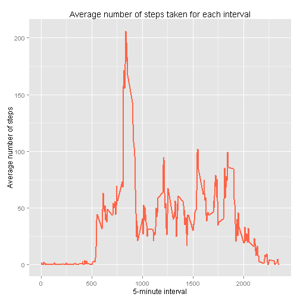

Reproducible Research - Peer Assessment 1
----------------------------------------


```r
#Import package
library(ggplot2)
library(plyr)
```

## Loading and preprocessing the data


```r
#Unzip dataset
unzip(zipfile="activity.zip")

#Read dataset
data <- read.csv("activity.csv")

#Convert date column
data$date <- as.Date(data$date, format="%Y-%m-%d")
```

## What is mean total number of steps taken per day?


```r
#Get total steps taken each day
total_steps_by_date <- aggregate(data$steps, list(date=data$date), sum)

#Rename aggregated column
total_steps_by_date <- rename(total_steps_by_date, c("x"="Total_Steps"))

#Plot histogram
ggplot(total_steps_by_date, aes(x=Total_Steps)) + geom_histogram(binwidth=1000, fill="dodgerblue", color="black") +
    labs(x="Total number of steps taken", title="Histogram of the total number of steps taken each day")
```

 

```r
#Mean number of steps taken per day
mean(total_steps_by_date$Total_Steps, na.rm=TRUE)
```

```
## [1] 10766.19
```

```r
#Median number of steps taken per day
median(total_steps_by_date$Total_Steps, na.rm=TRUE)
```

```
## [1] 10765
```

## What is the average daily activity pattern?

```r
#Get averages for each date
mean_steps_by_interval <- aggregate(data$steps, list(interval=data$interval), mean, na.rm=TRUE)

#Rename aggregated column
mean_steps_by_interval <- rename(mean_steps_by_interval, c("x"="Mean_Steps"))

#Plot time series
ggplot(mean_steps_by_interval, aes(interval, Mean_Steps)) + geom_line(color="tomato", size=1) +
    labs(x="5-minute interval", y="Average number of steps", title="Average number of steps taken for each interval")
```

 

```r
#Interval having maximum average number of steps taken
mean_steps_by_interval[mean_steps_by_interval$Mean_Steps==max(mean_steps_by_interval$Mean_Steps),]
```

```
##     interval Mean_Steps
## 104      835   206.1698
```

## Imputing missing values

**Strategy**: Replace missing values with mean of the corresponding 5-minute interval.


```r
#Number of rows, having missing values
nrow(data[is.na(data$steps),])
```

```
## [1] 2304
```

```r
#Get mean for each 5-minute interval
mean_steps_by_interval <- aggregate(data$steps, list(interval=data$interval), mean, na.rm=TRUE)

#Rename aggregated column
mean_steps_by_interval <- rename(mean_steps_by_interval, c("x"="Mean_Steps"))

#Create new copy of data
fdata <- data

#Impute missing values
fdata$steps <- mapply(function(y,z)
{
  if(is.na(y))
    mean_steps_by_interval[mean_steps_by_interval$interval==z,2]
  else
    y
}, data$steps, data$interval)

#Check rows having missing values
nrow(fdata[is.na(fdata$steps),])
```

```
## [1] 0
```

```r
#Get total steps taken each day
total_steps_by_date_filled <- aggregate(fdata$steps, list(day=fdata$date), sum)

#Rename aggregated column
total_steps_by_date_filled <- rename(total_steps_by_date_filled, c("x"="Total_Steps"))

#Plot histogram
ggplot(total_steps_by_date_filled, aes(x=Total_Steps)) + geom_histogram(binwidth=1000, fill="steelblue", color="black") +
    labs(x="Total number of steps taken", title="Histogram of the total number of steps taken each day\n (Imputed missing values)")
```

 

```r
#Mean total number of steps taken per day
mean(total_steps_by_date_filled$Total_Steps, na.rm=TRUE)
```

```
## [1] 10766.19
```

```r
# Median number of steps taken per day
median(total_steps_by_date_filled$Total_Steps, na.rm=TRUE)
```

```
## [1] 10766.19
```
**Observation**   
After imputing missing values, the mean and median has increased. 
However, the general shape remains unchanged. 

## Are there differences in activity patterns between weekdays and weekends?

```r
#Add day type column
fdata$dayType <- lapply(fdata$date, function(x)
{
  wday <- weekdays(x)
  if (wday %in% c("Monday", "Tuesday", "Wednesday", "Thursday", "Friday"))
    "weekday"
  else
    "weekend"
})

#Convert column into factor type
fdata$dayType <- factor(unlist(fdata$dayType))

#Get mean for each 5-minute interval
means_by_interval_filled <- aggregate(fdata$steps, list(interval=fdata$interval, dayType=fdata$dayType), mean, na.rm=TRUE)

#Rename aggregated column
means_by_interval_filled <- rename(means_by_interval_filled, c("x"="Mean_Steps"))

#Plot histogram
ggplot(means_by_interval_filled, aes(interval, Mean_Steps)) + geom_line(color="salmon", size=1) + 
    facet_grid(dayType ~ .) +
    labs(x="5-minute interval", y="Average number of steps", 
         title="Average number of steps taken for each interval and \nday type (weekday/weekend)")
```

 
